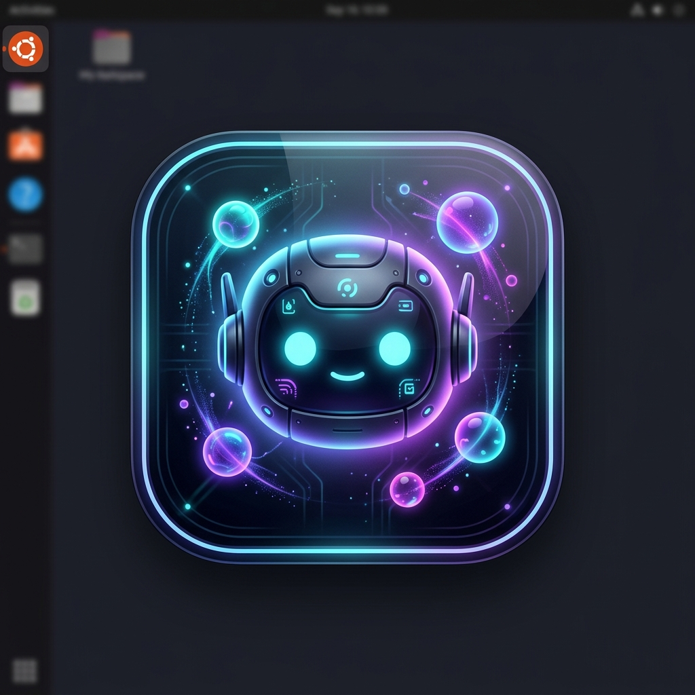

# 🏝️ Ubuntu Dynamic Island — Dio AI Assistant

<div align="center">



**An Apple-style Dynamic Island and autonomous desktop AI companion designed exclusively for Ubuntu Linux.**  
*Floating fluidly at the top of your display, Dio brings voice control, desktop agency, hands-free wake-word detection, real-time context awareness, and live web knowledge directly to your workspace.*

[](https://ubuntu.com)
[](https://www.electronjs.org/)
[](https://nodejs.org/)
[](https://avalai.ir)
[](LICENSE)

</div>

---

## 🌟 Highlights

```
 ╭────────────────────────────────────────────────────────────────╮
 │  🤖 Dio Mascot    🎵 Music Scrubber   🎙️ Hey Dio Wake-Word   │
 │  🧠 Context Aware  🌐 Live Web Search  🖥️ Desktop App Control   │
 ╰────────────────────────────────────────────────────────────────╯
```

- **🍎 Fluid Apple Physics**: A compact OLED capsule (400px × 44px) pinned to your top panel that morphs into a frosted glass control hub (760px × 560px). Non-blocking bounding box ensures your workspace remains 100% clickable.
- **🤖 Cyber Mascot Animations**: Animated SVG companion with reactive states:
  - **Listening**: Electric cyan aura and pulsating antenna sonar waves.
  - **Thinking / Working**: Horizontal eye scan radar sweep.
  - **Speaking**: Natural mouth speech movement synchronized to voice playback.
  - **Idle**: Gentle breathing glow with realistic eyelid blinks.
- **🎙️ Dual-Engine Hands-Free Wake-Word**: Continuous 16kHz PCM circular ring buffer coupled with speech recognition. Just say **"Hey Dio"** anywhere in your room to awaken your island.
- **🧠 Enhanced Context Understanding**: Dio detects your active window (e.g. *Antigravity IDE*), open desktop apps, local system time, and current music playback to answer contextual queries like *"What am I editing right now?"*.
- **👤 Deep Personalization**: Configure your nickname, preferred persona tone (**Friendly Bro**, **Jarvis Tech AI**, or **Concise Coder**), and custom workflow knowledge in Settings.
- **🌐 Expanded Knowledge Base**: Live web & Wikipedia knowledge search cards with spoken audio summaries for instant tech news and facts.
- **🖥️ Full Linux Desktop Agency**: Dio can focus windows, launch apps, type messages into applications (e.g. *Antigravity IDE*), switch audio output to your HDMI monitor, and execute terminal commands.
- **✂️ Interactive Screen Snipper**: Crop any region of your display on-the-fly and have Dio visually inspect and solve tasks.
- **🎵 MPRIS Media Controller**: Compact pill and expanded notch music player with live progress scrubber, album art vinyl, and play/pause/skip controls.
- **🔕 Notification Hub**: Intercepts native Ubuntu notification banners so Dio presents clean, interactive alerts without desktop clutter.

---

## 📸 Interface Preview

| State | Preview Description |
| :--- | :--- |
| **Compact Pill** | Minimal status bar showing Dio's animated face, time, CPU/RAM stats, and active audio capsule |
| **Music Capsule** | Interactive vinyl record, live title/artist ticker, and compact play/pause toggle |
| **Expanded Island** | Multi-tab hub: Chat with Dio, Music Player with scrubber, System Gauges, Notion Hub, and Settings |
| **Screen Snipper** | High-precision interactive region selector that attaches cropped areas directly to Dio's vision |

---

## 🚀 Quick Start & Installation

### 1. System Prerequisites

Ubuntu Dynamic Island leverages native Linux tools for window automation and audio routing. Install the required system packages:

```bash
sudo apt update
sudo apt install -y wmctrl python3-pip python3-pyautogui libasound2-dev git
```

*Note: For PipeWire audio management (`wpctl`), Ubuntu 22.10+ and 24.04 include it by default.*

### 2. Clone the Repository

```bash
git clone https://github.com/AyhanMehrzad/ubuntu-dynamic-island.git
cd ubuntu-dynamic-island
```

### 3. Install Node.js Dependencies

```bash
npm install
```

### 4. Launch the Dynamic Island

```bash
./scripts/launch.sh
```

Or via npm:

```bash
npm start
```

---

## ⚙️ Configuration & Personalization

Open the Dynamic Island and navigate to the **Settings** (⚙️) tab:

### 1. Dio Personalization & Persona Tone
- **Call Me**: Set your name or nickname (e.g., `rupper`, `Boss`).
- **Persona Tone**:
  - `Friendly Bro`: Casual, energetic, peer-like tone.
  - `Jarvis Tech AI`: Sophisticated, crisp, respectful British assistant.
  - `Concise Coder`: Minimal fluff, maximum technical density.
- **Custom Workflow Knowledge**: Tell Dio about your preferred tools (e.g., *"My primary IDE is Antigravity. Always answer in spoken voice."*).
- Click **Save Personalization**.

### 2. AI Providers
- **⚡ Aval AI (Recommended)**: Ultra-fast gateway with OpenAI Whisper STT, TTS, and GPT-4o-mini.
- **OpenRouter API**: Access 200+ global models (Xiaomi MiMo, Claude 3.5, DeepSeek, free tier models).
- **Google Gemini API**: Gemini 2.0 Flash / 1.5 Pro.
- **Custom / Local**: Ollama (`http://localhost:11434/v1`) or local proxy.

### 3. Audio & Monitor Selection
- **Audio Output**: Switch default routing between **HDA NVidia Digital Stereo (HDMI)** and Built-in Analog Speakers.
- **Multi-Monitor**: Select which display pins the Dynamic Island capsule.

---

## 🗣️ Voice Commands & Usage

Wake Dio anytime with **"Hey Dio"** (or click the microphone icon) and speak naturally:

### 🖥️ Desktop & Window Automation
- *"Switch to Antigravity IDE"*
- *"Tell Antigravity to run npm build"*
- *"Focus Google Chrome"*
- *"Open Terminal"*
- *"Take a screenshot"*
- *"Lock screen"*

### 🧠 Contextual Awareness
- *"What window is active?"*
- *"What file am I working on?"*
- *"What's playing right now?"*
- *"What is today's date and time?"*

### ⚡ Compound Actions
- *"Mute sound and switch to Antigravity"*
- *"Pause music and open Chrome"*
- *"Stop song and open Terminal"*

### 🌐 Live Knowledge Search
- *"Search for Quantum Computing breakthrough"*
- *"Latest news on React 19"*
- *"Look up Ubuntu 24.10 release notes"*

### 🎵 Media & Audio Control
- *"Play"* / *"Pause"* / *"Next song"* / *"Previous track"*
- *"Set volume to 80%"*
- *"Switch sound to Main Display (HDMI)"*

---

## ⌨️ Global Keybindings

| Shortcut | Action |
| :--- | :--- |
| <kbd>Super</kbd> + <kbd>I</kbd> | Toggle Island Expand / Collapse |
| <kbd>Ctrl</kbd> + <kbd>Shift</kbd> + <kbd>Space</kbd> | Alternative Global Summon Hotkey |
| <kbd>Alt</kbd> + <kbd>Space</kbd> | Quick Hotkey |
| <kbd>Esc</kbd> | Instant Collapse to Pill |

---

## 🔄 Enable Autostart on Boot

To run Dynamic Island automatically when logging into Ubuntu:

```bash
./scripts/install-autostart.sh
```

To disable, toggle the **Start Automatically on Login** option in the Settings tab.

---

## 🏗️ Project Architecture

```
ubuntu-dynamic-island/
├── main.js                  # Electron main process, IPC handlers & system bindings
├── preload.js               # Secure context bridge exposing desktop APIs
├── package.json             # App manifest & build scripts
├── scripts/
│   ├── launch.sh            # Safe daemon launcher with banner suppression
│   └── install-autostart.sh # Desktop entry installer for ~/.config/autostart
└── src/
    ├── index.html           # Island layout, tabs, mascot SVG & player UI
    ├── css/
    │   ├── island.css       # Dynamic Island geometry, OLED styling & mascot animations
    │   └── components.css   # Action cards, knowledge cards & controls
    └── js/
        ├── app.js           # Island state manager & MPRIS media controller
        ├── agent.js         # Dio Agent core: Wake-Word, Whisper PCM, LLM calls & TTS
        ├── settings.js      # Profile persistence, AI credentials & theme manager
        ├── system.js        # System metrics & app launcher
        ├── notion.js        # Notion workspace integration
        └── sound.js         # Web Audio API Apple haptic sound generator
```

---

## 🤝 Contributing

Contributions, feature suggestions, and bug reports are welcome!
1. Fork the Project.
2. Create your Feature Branch (`git checkout -b feature/AmazingFeature`).
3. Commit your Changes (`git commit -m 'Add some AmazingFeature'`).
4. Push to the Branch (`git push origin feature/AmazingFeature`).
5. Open a Pull Request.

---

## 📄 License

Distributed under the **MIT License**. See `LICENSE` for more information.

<div align="center">
Built with ❤️ for the Ubuntu & Linux Community by Ayhan Mehrzad
</div>
